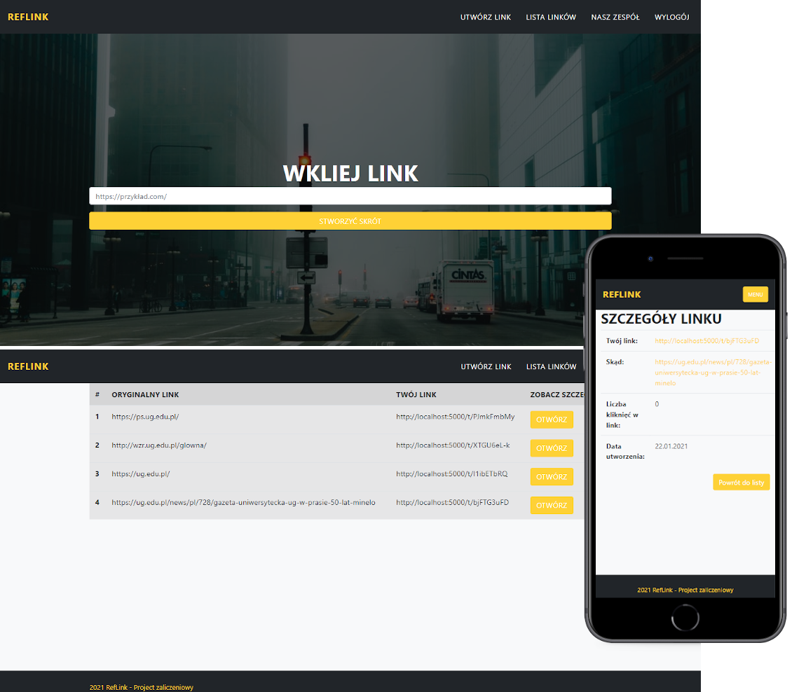
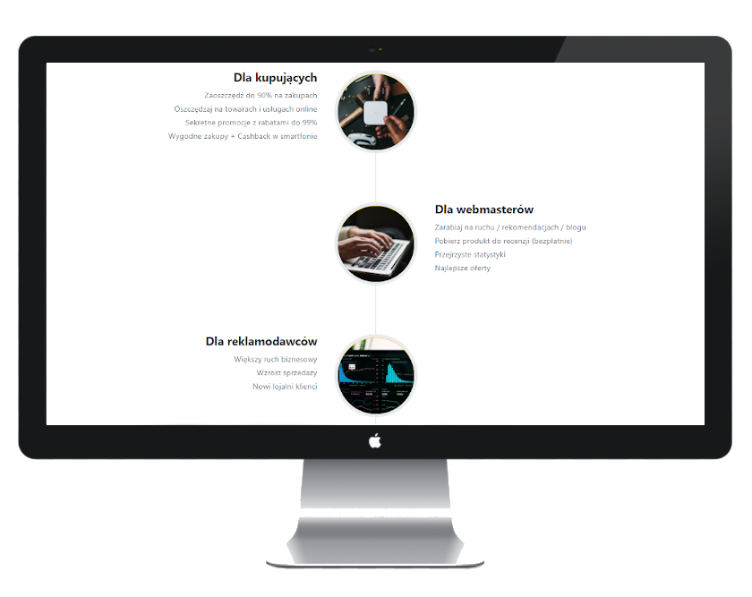

# MernProject 
## Table of contents
* [General info](#general-info)
* [Screenshots](#screenshots)
* [Technologies Used](#technologies-used)
* [Setup](#setup)


## General info
The project was developed as an affiliate program that provides conditions for cooperation for advertisers and webmasters.
The benefits are clear to each side:
* for webmasters - convenient and profitable traffic monetization;
* for advertisers - an increase in turnover, new regular customers and an increase in brand awareness;
* for both - a convenient and honest service, which is constantly being improved.

The background photos change every time due to the use of the [Unsplash Source](https://source.unsplash.com).


## Screenshots




## Technologies Used:
1.  [React](https://github.com/facebook/react)
2.  [Node.js](https://github.com/nodejs/node)
3.  [MongoDB](https://github.com/mongodb/mongo)


## Setup
To run this project, install it locally using npm:

```
$ npm run dev
```
